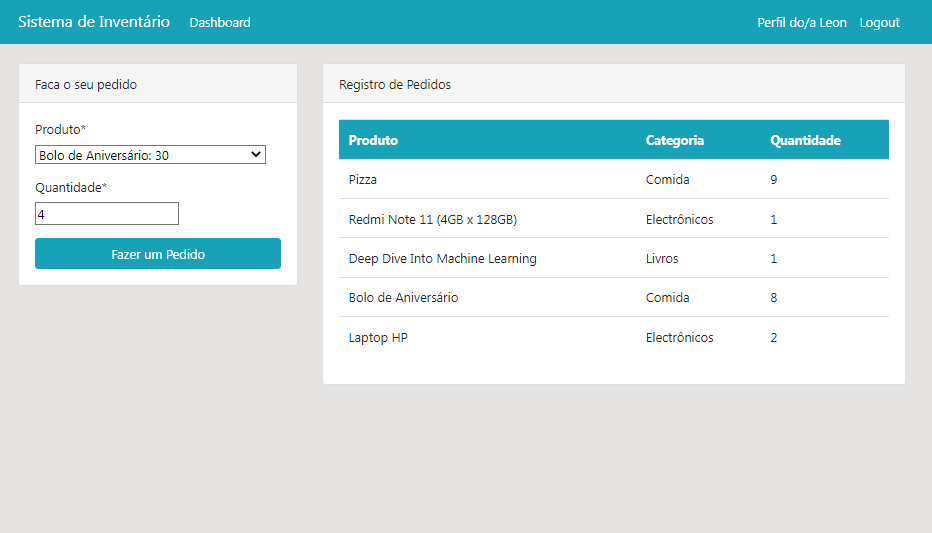

# Sistema de Inventário com Django

Este é um sistema de inventário desenvolvido em Django que permite a gestão de produtos, pedidos e autenticação de usuários, além de visualização de dados em gráficos usando Chart.js

## Funcionalidades Principais

- **CRUD de Produtos**: Gerencie seus produtos com operações de criação, leitura, atualização e exclusão.

- **Pedidos de Produtos**: Usuários podem fazer pedidos de produtos disponíveis.

- **Administração de Pedidos**: Os administradores podem gerenciar os pedidos dos usuários.

- **Autenticação de Usuários**: Controle de acesso com autenticação de usuários e permissões.

- **Recuperação de Senha**: Funcionalidade para criar uma nova senha caso o usuário esqueça a atual.

- **Visualização em Gráficos**: Dados de pedidos e produtos são apresentados em gráficos interativos usando Chart.js.

## Instalação e Configuração

1. Clone este repositório.
2. Crie um ambiente virtual e ative-o.
3. Instale as dependências usando `pip install -r requirements.txt`.
4. Configure o arquivo `settings.py` com suas configurações de banco de dados.
5. Execute as migrações: `python manage.py migrate`.
6. Crie um superusuário para acesso ao painel de administração: `python manage.py createsuperuser`.
7. Inicie o servidor de desenvolvimento: `python manage.py runserver`.

## Uso

1. Acesse o painel de administração em: `http://127.0.0.1:8000/admin` e faça login com suas credenciais de superusuário. 
2. Adicione produtos, funionários e gerencie pedidos.
3. Tela de Dasboard: A tela de dashboard oferece uma visualização completa das informações do sistema em gráficos interativos usando Chart.js. Para acessá-la: `http://127.0.0.1:8000/dashboard`.
4. Os usuários podem se registrar e fazer pedidos a partir da página principal.

## Contribuição

Sinta-se à vontade para contribuir com melhorias, correções de bugs ou novas funcionalidades.
